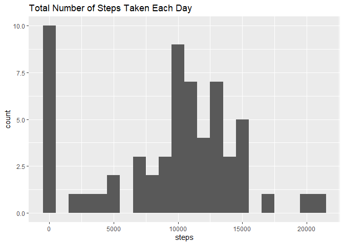

## Loading and preprocessing the data
1. Download the [activity monitoring data](https://d396qusza40orc.cloudfront.net/repdata%2Fdata%2Factivity.zip) to my local hard drive.
2. Make sure that the working directory is correct. 
3. Import the data into R.

```r
  #This is a one-time effort
  activity <- read.csv("Week2/activity.csv")
```


## What is mean total number of steps taken per day?

```r
library(ggplot2)
library(tidyverse)
```

```
## -- Attaching packages ------------------------------------------------ tidyverse 1.3.0 --
```

```
## <U+2713> tibble  3.0.0     <U+2713> dplyr   0.8.5
## <U+2713> tidyr   1.0.2     <U+2713> stringr 1.4.0
## <U+2713> readr   1.3.1     <U+2713> forcats 0.5.0
## <U+2713> purrr   0.3.3
```

```
## -- Conflicts --------------------------------------------------- tidyverse_conflicts() --
## x dplyr::filter() masks stats::filter()
## x dplyr::lag()    masks stats::lag()
```

```r
total.steps <- activity %>% group_by(date) %>% summarise(steps = sum(steps, na.rm = T))
#histogram
total.steps %>% ggplot(aes(x = steps)) + geom_histogram(binwidth=1000) + ggtitle("Total Number of Steps Taken Each Day") 
```



```r
#mean
mean(total.steps$steps, na.rm=TRUE)
```

```
## [1] 9354.23
```

```r
#median
median(total.steps$steps, na.rm=TRUE)
```

```
## [1] 10395
```


## What is the average daily activity pattern?

```r
averages <- activity %>% group_by(interval) %>% summarise(avg = mean(steps, na.rm = TRUE))
#time series plot
averages %>% ggplot(aes(x=interval, y=avg)) +
    geom_line() +
    xlab("5-minute interval") +
    ylab("average number of steps taken")
```

<!-- -->

```r
#maximum number of steps
averages[which.max(averages$avg),]
```

```
## # A tibble: 1 x 2
##   interval   avg
##      <int> <dbl>
## 1      835  206.
```


## Imputing missing values


```r
missing <- is.na(activity$steps)
# How many missing
table(missing)
```

```
## missing
## FALSE  TRUE 
## 15264  2304
```

```r
#1. the total number of missing values in the dataset: 2304
```


```r
#2. Devise a strategy for filling in all of the missing values in the dataset.
#Replace each missing value with the mean value of its 5-minute interval

library(magrittr)
```

```
## 
## Attaching package: 'magrittr'
```

```
## The following object is masked from 'package:purrr':
## 
##     set_names
```

```
## The following object is masked from 'package:tidyr':
## 
##     extract
```

```r
library(dplyr)

replacewithmean <- function(x) replace(x, is.na(x), mean(x, na.rm = TRUE))
meandata <- activity %>% group_by(interval) %>% mutate(steps= replacewithmean(steps))
head(meandata)
```

```
## # A tibble: 6 x 3
## # Groups:   interval [6]
##    steps date       interval
##    <dbl> <fct>         <int>
## 1 1.72   2012-10-01        0
## 2 0.340  2012-10-01        5
## 3 0.132  2012-10-01       10
## 4 0.151  2012-10-01       15
## 5 0.0755 2012-10-01       20
## 6 2.09   2012-10-01       25
```

```r
filled.data <- aggregate(meandata$steps, by=list(meandata$date), sum)

names(filled.data)[1] ="date"
names(filled.data)[2] ="steps"
head(filled.data,15)
```

```
##          date    steps
## 1  2012-10-01 10766.19
## 2  2012-10-02   126.00
## 3  2012-10-03 11352.00
## 4  2012-10-04 12116.00
## 5  2012-10-05 13294.00
## 6  2012-10-06 15420.00
## 7  2012-10-07 11015.00
## 8  2012-10-08 10766.19
## 9  2012-10-09 12811.00
## 10 2012-10-10  9900.00
## 11 2012-10-11 10304.00
## 12 2012-10-12 17382.00
## 13 2012-10-13 12426.00
## 14 2012-10-14 15098.00
## 15 2012-10-15 10139.00
```

```r
##Method 2. This works, but knitr can't generate the code. 
#a copy of the main dataset; the imputed steps will be included here
#filled.data <- activity
#vector of missing data
#missing.data <- filled.data[is.na(filled.data$steps),]
#fill.value <- function (steps, interval){ 
#  averages[averages$interval==interval, "steps"]
#  }
#missing.data$steps <- mapply(fill.value, missing.data$steps, missing.data$interval, SIMPLIFY = TRUE)


#filled.data$steps[is.na(filled.data$steps)] <- missing.data$steps
#filled.data
#As you can see, no missing data in the new dataset
#filled.data[is.na(filled.data$steps),]
```


```r
total.steps2 <- filled.data %>% group_by(date) %>% summarise(steps = sum(steps, na.rm = T))
#histogram
total.steps2 %>% ggplot(aes(x = steps)) + geom_histogram(binwidth=1000) + ggtitle("Total Number of Steps Taken Each Day") 
```

<!-- -->

```r
#mean
mean(total.steps2$steps, na.rm=TRUE)
```

```
## [1] 10766.19
```

```r
#median
median(total.steps2$steps, na.rm=TRUE)
```

```
## [1] 10766.19
```

```r
#Do these values differ from the estimates from the first part of the assignment? What is the impact of imputing missing data on the estimates of the total daily number of steps?
print("these values are higher than the first part of the assignment")
```

```
## [1] "these values are higher than the first part of the assignment"
```

```r
print("Imputing the missing data helps to fix the skewness of the data")
```

```
## [1] "Imputing the missing data helps to fix the skewness of the data"
```


## Are there differences in activity patterns between weekdays and weekends?


```r
#1. Create a new factor variable in the dataset with two levels – “weekday” and “weekend” indicating whether a given date is a weekday or weekend day.
meandata$date <- as.Date(meandata$date)
meandata$weekday <- weekdays(meandata$date)
meandata$weekend <- ifelse(meandata$weekday=="Saturday" | meandata$weekday=="Sunday", "Weekend", "Weekday" )

#2. Make a panel plot containing a time series plot (i.e. \color{red}{\verb|type = "l"|}type="l") of the 5-minute interval (x-axis) and the average number of steps taken, averaged across all weekday days or weekend days (y-axis). See the README file in the GitHub repository to see an example of what this plot should look like using simulated data.
meandataweekendweekday <- aggregate(meandata$steps , by= list(meandata$weekend, meandata$interval), na.omit(mean))
names(meandataweekendweekday) <- c("weekend", "interval", "steps")

ggplot(meandataweekendweekday, aes(x=interval, y=steps, color=weekend)) + geom_line()+
facet_grid(weekend ~.) + xlab("Interval") + ylab("Mean of Steps") +
    ggtitle("Comparison of Average Number of Steps in Each Interval")
```

<!-- -->

